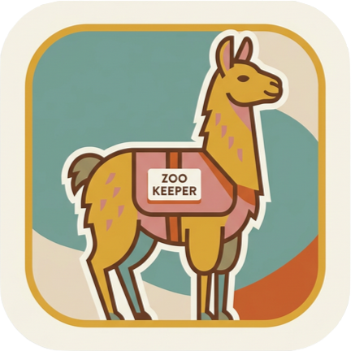

<p align="center">
  
</p>

<h1 align="center">Zoo-Keeper</h1>

<p align="center">
  <b> Insert Short Description Here</b><br/>
  <sub>Quick Info 1 &bull; Quick Info 2 &bull; Quick Info 3</sub>
</p>

<p align="center">
  
  
  
</p>

A C++23 library built on [llama.cpp](https://github.com/ggerganov/llama.cpp) that wraps and harnesses local LLMs for agentic behavior. Zoo-Keeper handles model loading, inference, conversation management, type-safe tool calling, and an async agentic loop -- so you can focus on your application.

## Features

- **Async Inference** -- non-blocking `chat()` with `std::future`, streaming token callbacks
- **Tool Calling** -- type-safe registration with automatic JSON schema generation
- **Agentic Loop** -- tool detection, argument validation, execution, result injection, retry
- **Context Management** -- automatic history tracking, system prompt preservation
- **Hardware Acceleration** -- Metal (macOS) and CUDA via llama.cpp
- **Modern Error Handling** -- C++23 `std::expected` throughout, no exceptions

## Quick Start

```cpp
#include <zoo/zoo.hpp>

int add(int a, int b) { return a + b; }

int main() {
    zoo::Config config;
    config.model_path = "models/llama-3-8b.gguf";
    config.context_size = 8192;

    auto agent = std::move(*zoo::Agent::create(config));
    agent->set_system_prompt("You are a helpful assistant.");
    agent->register_tool("add", "Add two numbers", {"a", "b"}, add);

    auto handle = agent->chat(zoo::Message::user("What is 42 + 58?"));
    auto response = handle.future.get();
    if (response) {
        std::cout << response->text << std::endl;
    }
}
```

## Building

```bash
git clone --recurse-submodules https://github.com/crybo-rybo/zoo-keeper.git
cd zoo-keeper
cmake -B build -DZOO_BUILD_TESTS=ON -DZOO_BUILD_EXAMPLES=ON
cmake --build build -j$(nproc)
```

See [docs/building.md](docs/building.md) for platform setup (Metal, CUDA), CMake options, sanitizers, coverage, and integration instructions.

## Architecture

Zoo-Keeper uses a three-layer design with strict dependency direction:

```
Layer 3: zoo::Agent        -- async orchestration, request queue, agentic tool loop
Layer 2: zoo::tools        -- tool registry, parser, validation (no llama.cpp dependency)
Layer 1: zoo::core         -- synchronous llama.cpp wrapper (Model)
```

See [docs/architecture.md](docs/architecture.md) for the full design.

## Documentation

| Guide | Description |
|-------|-------------|
| [Getting Started](docs/getting-started.md) | Prerequisites, build, hello-world agent, core API overview |
| [Architecture](docs/architecture.md) | Three-layer design, threading model, design principles |
| [Tools](docs/tools.md) | Template registration, supported types, manual schema, error recovery |
| [Configuration](docs/configuration.md) | Config fields, sampling params, generation limits |
| [Examples](docs/examples.md) | Streaming, tools, error handling, cancellation, metrics |
| [Building](docs/building.md) | CMake options, platform setup, sanitizers, coverage |
| [API Reference](docs/building.md#api-reference) | Generate Doxygen HTML locally, download CI artifacts, or browse the published Pages site |

Generate the API reference locally with:

```bash
cmake -B build -DZOO_BUILD_DOCS=ON
cmake --build build --target zoo_docs
```

The generated site is written to `build/docs/doxygen/html/index.html`. GitHub Actions also builds and uploads the documentation on every push and deploys the latest `main` version to GitHub Pages.

## Testing

142 unit tests plus 4 integration tests for the concrete Model/Agent layers:

```bash
ctest --test-dir build --output-on-failure
```

Configure with `-DZOO_BUILD_INTEGRATION_TESTS=ON` and optionally set `ZOO_INTEGRATION_MODEL=/absolute/path/to/model.gguf` to enable the live generation smoke tests.

## Acknowledgments

- [llama.cpp](https://github.com/ggerganov/llama.cpp) by Georgi Gerganov
- [nlohmann/json](https://github.com/nlohmann/json) by Niels Lohmann
- [GoogleTest](https://github.com/google/googletest) by Google

## License

MIT
