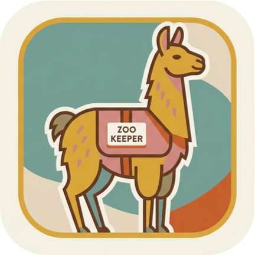

<p align="center">
  
</p>

<h1 align="center">Zoo-Keeper</h1>

<p align="center">
  <b>The C++23 SDK for embedding local LLMs into your applications.</b><br/>
  <sub>Async agent runtime &bull; Native tool calling &bull; Structured output &bull; Zero network dependency</sub>
</p>

<p align="center">
  
  
  
</p>

---

## What is Zoo-Keeper?

Zoo-Keeper is a C++23 inference SDK built on [llama.cpp](https://github.com/ggerganov/llama.cpp). It wraps the raw C API with a layered, type-safe library for embedding local LLMs in desktop apps, tools, games, and edge systems — no server required.

**llama.cpp is the engine. Zoo-Keeper is the SDK.**

At a high level, Zoo-Keeper provides:

- **`zoo::core::Model`** — synchronous model loading, generation, and history
- **`zoo::Agent`** — async requests, streaming, cancellation, tool execution, and structured extraction
- **`zoo::tools`** — tool registration, parsing, and schema validation (no llama.cpp dependency)
- **`zoo::hub`** *(optional)* — HuggingFace downloads and a local model store

See [Architecture](docs/architecture.md) for layer diagrams, threading guarantees, and the request lifecycle.

## Quick Start

```bash
git clone https://github.com/crybo-rybo/zoo-keeper.git
cd zoo-keeper
scripts/build.sh -DZOO_BUILD_EXAMPLES=ON
```

llama.cpp is fetched automatically at CMake configure time.

```cpp
#include <zoo/zoo.hpp>

auto agent = zoo::Agent::create(model_config).value();
agent->try_set_system_prompt("You are a helpful assistant.").value();
auto handle = agent->chat("Hello!");
auto response = handle.await_result().value();
```

For CMake integration, configuration, tools, streaming, and error handling, see [Getting Started](docs/getting-started.md) and [Building](docs/building.md).

## Documentation

| Guide | Description |
|-------|-------------|
| [Getting Started](docs/getting-started.md) | First build, first agent, core API walkthrough |
| [Building](docs/building.md) | CMake setup, FetchContent, Metal/CUDA, sanitizers, install/package |
| [Configuration](docs/configuration.md) | Model config, sampling parameters, generation limits, history budgets |
| [Tools](docs/tools.md) | Typed tools, manual schema registration, supported schema subset, error handling |
| [Structured Output](docs/extract.md) | Grammar-constrained extraction, schema reference, stateful vs. stateless |
| [Hub Layer](docs/hub.md) | HuggingFace downloading, local model store, and how hub code uses core inspection |
| [Architecture](docs/architecture.md) | Layer design, runtime ownership, threading model, target structure |
| [Examples](docs/examples.md) | Streaming, cancellation, tools, error handling, model store |
| [Compatibility](docs/compatibility.md) | Public API boundary, 1.x stability policy, deprecation rules |
| [Migration](MIGRATION.md) | Upgrade notes for major API changes |

## Testing

```bash
scripts/test.sh
```

See [Building](docs/building.md) for hub builds, integration tests, and sanitizers.

## Acknowledgments

- [llama.cpp](https://github.com/ggerganov/llama.cpp) by Georgi Gerganov — the inference engine beneath the SDK
- [nlohmann/json](https://github.com/nlohmann/json) by Niels Lohmann
- [GoogleTest](https://github.com/google/googletest) by Google

## License

MIT
