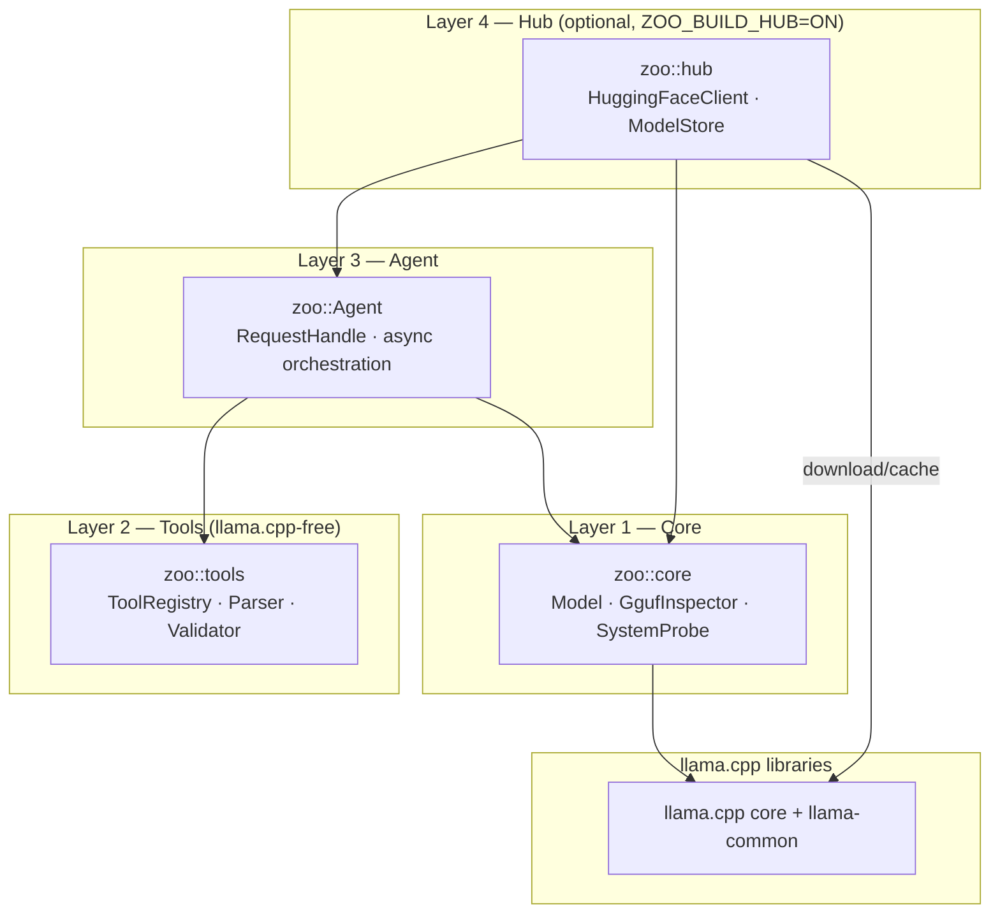
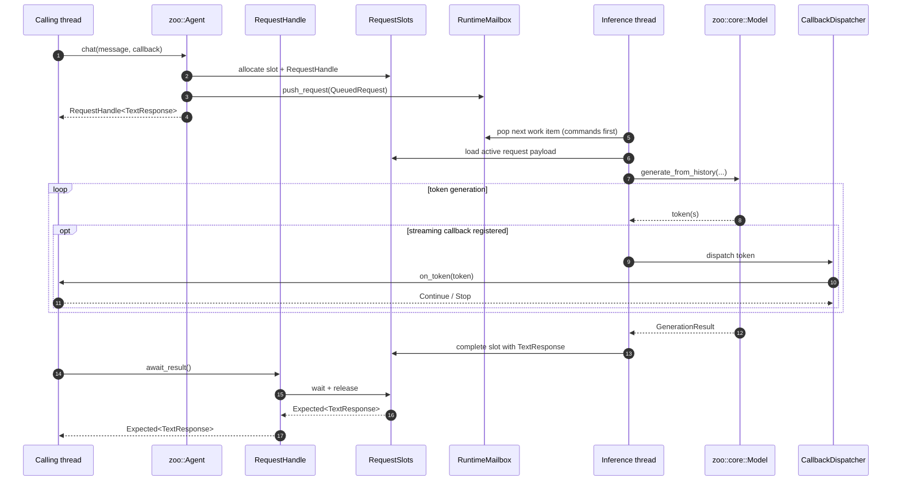
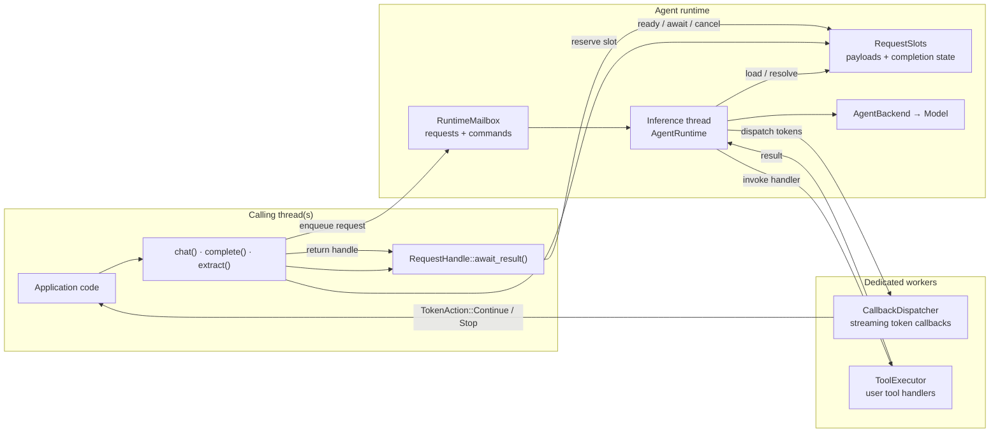
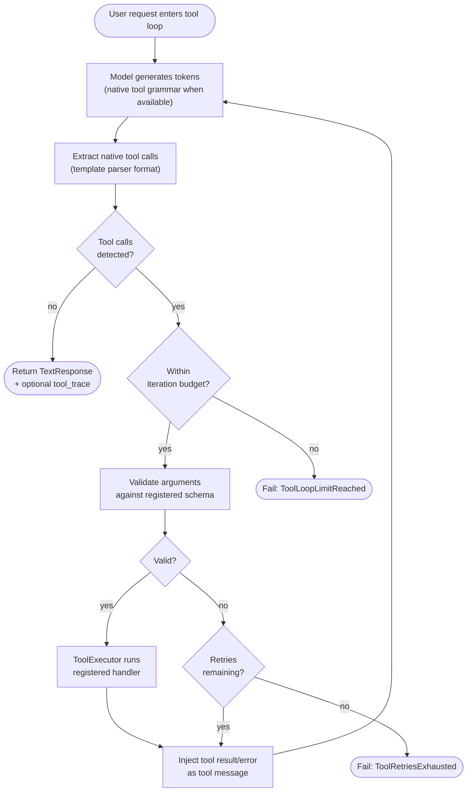

# Architecture

Zoo-Keeper exposes three core public layers plus an optional hub layer. Higher
layers build on lower layers, and consumers can stop at the lowest layer that
fits their needs.

## Public Layers

| Layer | Primary Types | Responsibility |
|-------|---------------|----------------|
| Hub *(optional)* | `zoo::hub::HuggingFaceClient`, `zoo::hub::ModelStore` | HuggingFace downloads, local model cataloging |
| Agent | `zoo::Agent`, `zoo::RequestHandle<Result>` | Async request submission, background inference, native tool orchestration |
| Tools | `zoo::tools::ToolRegistry`, `zoo::tools::ToolCallParser`, `zoo::tools::ToolArgumentsValidator` | Tool registration, native tool-call parsing, schema validation |
| Core | `zoo::core::Model`, `zoo::core::GgufInspector`, `zoo::core::SystemProbe` | Direct synchronous llama.cpp wrapper, GGUF metadata read, hardware probe, hardware-aware auto-configuration |

## Usage Model

### `zoo::core::Model`

Use `Model` when you want direct, single-threaded inference without the agent
runtime. It owns model loading, prompt rendering, history, KV-cache
interaction, sampling, and generation.

### `zoo::Agent`

Use `Agent` when you want queued asynchronous requests, streaming callbacks,
cancellation, native tool execution, and a choice between stateful `chat(...)`
requests and stateless request-scoped `complete(...)` requests. `Agent` is the
primary high-level runtime surface for most consumers.

`RequestHandle<Result>` is the public async return type. It carries the request
ID and exposes `cancel()`, `ready()`, and `await_result()` for cancellation,
polling, and retrieving the completed response or error.

### Request lifecycle

1. The calling thread submits via `chat()`, `complete()`, or `extract()` and
   receives a `RequestHandle<Result>` immediately.
2. The runtime enqueues work on the inference thread through
   `RuntimeMailbox` (commands are prioritized over queued requests).
3. Generation runs on `zoo::core::Model`; optional streaming callbacks are
   dispatched on `CallbackDispatcher`.
4. The caller observes completion through `await_result()`.

## Public Threading Guarantees

- `zoo::Agent` owns a background inference thread.
- Requests are submitted from the calling thread through `chat(...)`,
  `complete(...)`, or `extract(...)`.
- Request completion is observed through `RequestHandle<Result>::await_result()`.
- Model state is owned by the inference thread while the agent is running.
- Streaming token callbacks execute on the CallbackDispatcher thread. Tool
  handlers execute on a dedicated ToolExecutor worker while the tool loop waits
  for their result.
- Direct `ToolRegistry` use is single-threaded unless callers externally
  synchronize overlapping operations. `Agent` serializes registry mutation on
  its inference thread.

These guarantees are part of the public behavioral contract. Private runtime
mechanisms that implement them are documented separately for maintainers.

## Tool Calling Model

Tool calling is native-only. Zoo-Keeper only executes model-emitted native tool
calls when the active model/template supports them. If the selected model does
not expose native tool calling, the runtime remains on the text path.

When `GenerationOptions::record_tool_trace` is enabled, the request can retain
a `tool_trace` describing the attempts made during the tool loop.

See [tools.md](tools.md) for registration, schema rules, and error codes.

## CMake Targets

| Target | Status | Notes |
|--------|--------|-------|
| `ZooKeeper::zoo` | Primary | Recommended target for new consumers |
| `ZooKeeper::zoo_core` | Compatibility only | Forwarding target retained for existing consumers |

## Design Goals

- One obvious public runtime story centered on `ZooKeeper::zoo`
- Small installed API surface under `include/zoo/`
- Explicit native tool execution data and deterministic tool metadata behavior
- Docs that describe supported behavior without exposing private implementation
  details as API

## For Maintainers

Internal runtime ownership, private module boundaries, and contributor-facing
invariants live in [maintainer-architecture.md](maintainer-architecture.md).
