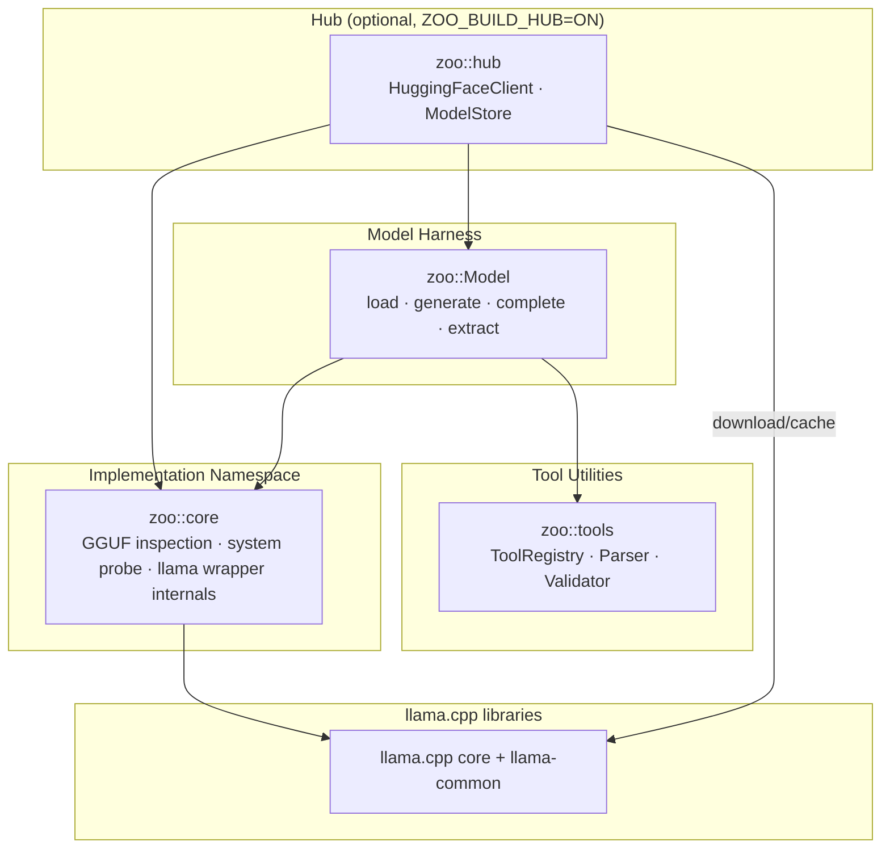

# Architecture

Zoo-Keeper is a llama.cpp harness centered on one loaded model session:
`zoo::Model`. The public API intentionally exposes Zoo-Keeper value types rather
than llama C API handles; all `llama_model`, `llama_context`, sampler, chat
template, grammar, and KV-cache ownership stays private.



## Public Surface

| Area | Primary Types | Responsibility |
|------|---------------|----------------|
| Model harness | `zoo::Model`, `ModelConfig`, `GenerationOptions` | Load GGUF models, own one llama.cpp session, manage history/KV state, generate text, run stateless completion, and extract schema-constrained JSON |
| Tool utilities | `zoo::tools::ToolRegistry`, `ToolCallParser`, `ToolArgumentsValidator`, `ToolSpec` | Build model-facing tool schemas, parse native tool calls, and validate arguments before caller-owned dispatch |
| Hub *(optional)* | `zoo::hub::HuggingFaceClient`, `zoo::hub::ModelStore` | Download GGUF files through llama.cpp cache paths and resolve catalog entries to `ModelConfig`/`Model` |
| Core implementation | `zoo::core::GgufInspector`, `zoo::core::SystemProbe` | Inspect GGUF metadata and probe host hardware for model configuration |

`zoo::core::Model` remains the underlying implementation type, but the normal
consumer entry point is the top-level alias `zoo::Model`.

## Model Session

`zoo::Model` is synchronous and not internally thread-safe. One instance owns:

- llama.cpp model/context handles
- chat-template rendering state
- sampler and grammar state
- retained message history
- KV-cache bookkeeping
- token usage and latency accounting

Use `generate(...)` for retained conversation turns, `complete(...)` for a
request-scoped conversation that restores the previous history afterward, and
`extract(...)` for grammar-constrained JSON output.

Streaming and cancellation are callback-based:

```cpp
auto on_token = [](std::string_view token) {
    std::cout << token << std::flush;
    return zoo::TokenAction::Continue;
};
auto should_cancel = [&] { return stop_requested.load(); };

auto response = model->generate("Hello", {}, on_token, should_cancel);
```

## Tool Calling

Tool calling is native-template only. `Model::set_tool_calling()` accepts
`std::vector<zoo::ToolSpec>` and asks llama.cpp's chat-template layer to prepare
the model-specific format, parser, grammar triggers, and stop sequences.

Zoo-Keeper does not run an autonomous tool loop. Callers parse generated native
tool calls through `Model::generate_from_history()` or
`Model::parse_tool_response()`, validate them with `zoo::tools`, dispatch them
through application code, then add `OwnedMessage::tool(...)` responses if they
want another model pass.

## CMake Target

| Target | Status | Notes |
|--------|--------|-------|
| `ZooKeeper::zoo` | Primary | Single supported target for consumers |

## Design Goals

- Keep llama.cpp coupling explicit and intentional.
- Keep llama handles out of public headers.
- Prefer one model-session story over backend abstraction or autonomous agent behavior.
- Keep tool execution caller-owned and observable through normal application code.
