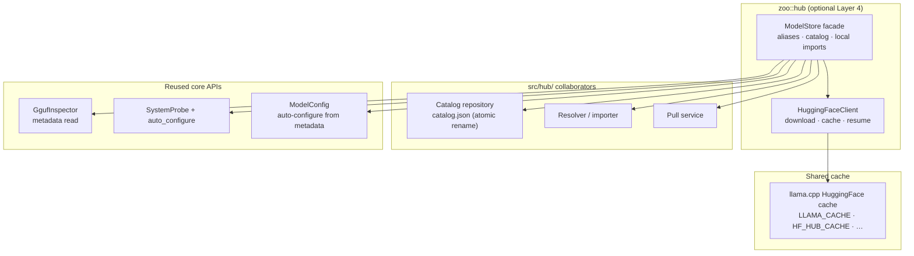

# Hub Layer

The hub layer (`zoo::hub`) is an optional Layer 4 that adds HuggingFace model
downloading and a local model catalog. It is only compiled when
`ZOO_BUILD_HUB=ON`.

```bash
scripts/build.sh -DZOO_BUILD_HUB=ON
```

There is no hub-specific example binary yet; the snippets below illustrate API
shape. Core-layer `GgufInspector` and `SystemProbe` work without enabling the
hub.

GGUF metadata inspection and hardware-aware auto-configuration live in the
core layer (`zoo::core::GgufInspector`, `zoo::core::SystemProbe`) so they are
available without enabling the hub.



## HuggingFace Client

`HuggingFaceClient` wraps llama.cpp's `llama-common` download infrastructure.
HuggingFace repository downloads go into llama.cpp's Hugging Face-style cache,
honoring the same environment variables as llama.cpp:

- `LLAMA_CACHE`
- `HF_HUB_CACHE`
- `HUGGINGFACE_HUB_CACHE`
- `HF_HOME`/`hub`
- `XDG_CACHE_HOME`/`huggingface/hub`
- `~/.cache/huggingface/hub`

Models downloaded by any llama.cpp tool (llama-cli, llama-server, etc.) are
immediately available, and vice versa. The client supports ETag caching,
resume, multi-split GGUF files, and retry with exponential backoff.

```cpp
auto hf = zoo::hub::HuggingFaceClient::create().value();

// Download a model (returns local file path)
auto path = hf->download_model("bartowski/Llama-3.2-3B-Instruct-GGUF:Q4_K_M");
if (!path) { /* handle error */ }

std::cout << "Downloaded to: " << *path << "\n";

// Download a specific file from a repository
auto exact = hf->download_model(
    "bartowski/Qwen3-8B-GGUF::Qwen3-8B-Q4_K_M.gguf");

// List models already in the llama.cpp cache
auto cached = zoo::hub::HuggingFaceClient::list_cached_models();
for (const auto& m : cached) {
    std::cout << m.to_string() << "\n";
}
```

For gated models, pass a bearer token via `HuggingFaceClient::Config`:

```cpp
auto hf = zoo::hub::HuggingFaceClient::create({.token = "hf_..."}).value();
```

## Identifier Formats

`HuggingFaceClient::parse_identifier()` accepts three formats:

| Format | Example | Meaning |
|--------|---------|---------|
| `owner/repo::file.gguf` | `bartowski/Qwen3-8B-GGUF::Qwen3-8B-Q4_K_M.gguf` | Specific file in a repository |
| `owner/repo:tag` | `bartowski/Qwen3-8B-GGUF:Q4_K_M` | Repository with quantization tag (ollama/llama.cpp style) |
| `owner/repo` | `bartowski/Qwen3-8B-GGUF` | Repository, resolves to best available GGUF |

## Model Store

`ModelStore` manages a local catalog of downloaded GGUF models, persisted as
JSON in the store directory (default: `~/.zoo-keeper/models/`). Catalog saves
write a temporary file and atomically rename it over `catalog.json`.

The store supports alias-based lookup and auto-configuration from cached
inspection metadata.

```cpp
auto store = zoo::hub::ModelStore::open().value();
auto hf = zoo::hub::HuggingFaceClient::create().value();

// Download and register in one step
store->pull(*hf, "bartowski/Qwen3-8B-GGUF:Q4_K_M", {"qwen3"});

// Or register a local file
store->add("/path/to/model.gguf", {"my-model"});

// Find by alias
auto entry = store->find("qwen3").value();
std::cout << entry.info.name << " at " << entry.file_path << "\n";

// Resolve stored metadata to a normal ModelConfig.
auto config = store->model_config("qwen3").value();
```

Catalog operations: `add()`, `remove()`, `find()`, `list()`, `add_alias()`.
Resolution order for `find()`: exact alias, exact model name, name substring,
file path, then catalog ID.

## Error Codes

Hub errors are returned as `zoo::Error` values whose `code` is one of the
hub-range `zoo::ErrorCode` enumerators.

| Code | Name | Description |
|------|------|-------------|
| 700 | `ErrorCode::GgufReadFailed` | Could not open or parse a GGUF file |
| 701 | `ErrorCode::GgufMetadataNotFound` | An expected metadata key was missing |
| 702 | `ErrorCode::ModelNotFound` | No model matched the given name, alias, or path |
| 703 | `ErrorCode::ModelAlreadyExists` | A model with the same path is already registered |
| 704 | `ErrorCode::DownloadFailed` | HTTP download failed |
| 706 | `ErrorCode::HuggingFaceApiError` | The HuggingFace API returned an error |
| 707 | `ErrorCode::InvalidModelIdentifier` | Could not parse the identifier string |
| 708 | `ErrorCode::StoreCorrupted` | The catalog JSON is malformed |
| 709 | `ErrorCode::FilesystemError` | A filesystem operation failed |

## See Also

- [Getting Started](getting-started.md) -- basic model harness setup
- [Architecture](architecture.md) -- layer design and model ownership
- [Examples](../examples/README.md) -- runnable model harness programs
