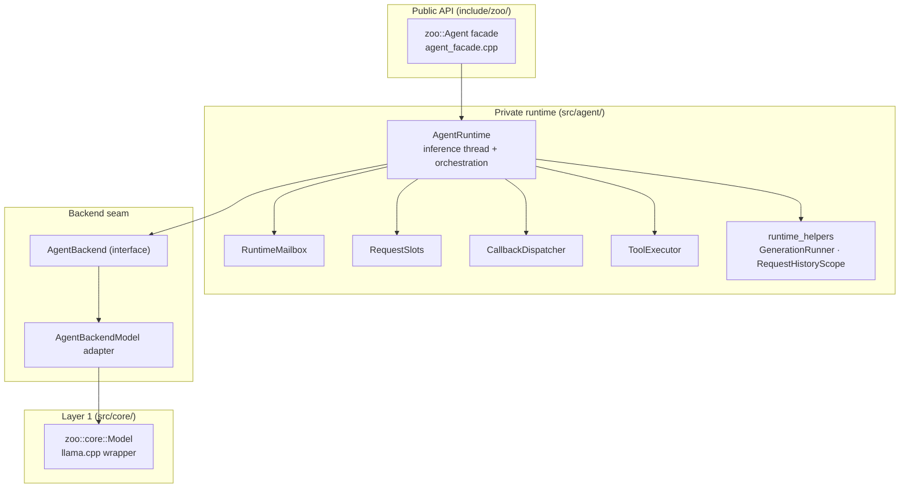

# Maintainer Architecture

This note documents the private module boundaries behind the public Zoo-Keeper API. It is for contributors working on runtime internals, build surface cleanup, and structural refactors. Public-facing guidance stays in [architecture.md](architecture.md).

## Boundary Rules

- Only headers under `include/zoo/` are part of the supported installed API.
- Private headers live under `src/` and must not be installed or documented as consumer dependencies.
- Public headers should describe API shape, not carry large runtime implementations.
- Prefer domain-specific types and seams over generic utility layers.

## Runtime Ownership

### Public facade

- `zoo::Agent` is a thin public facade.
- Construction, destruction, and public forwarding live in `src/agent/agent_facade.cpp`.
- The facade owns configuration and a private implementation handle only.

### Private runtime

- `internal::agent::AgentRuntime` owns the inference thread and the orchestration loop.
- The runtime owns:
  - the request mailbox
  - request tracking and cancellation state
  - the tool registry used during the tool loop
  - the tool executor worker used for handler invocation
  - the backend seam used to talk to the model layer
- Calling-thread operations that need model state are routed into the runtime instead of touching the model directly.

The dual-lane `RuntimeMailbox` prioritizes control commands over queued
requests so model-affecting operations never run mid-generation. Request
backpressure is enforced externally by `RequestSlots`.

### Backend seam

- `internal::agent::AgentBackend` is the only model-facing interface the runtime depends on.
- The production adapter wraps `zoo::core::Model`.
- Tests use fake backends through this seam to validate orchestration behavior without a live model.
- This seam is intentionally private; it exists to test the runtime, not to become a second public model abstraction.

## Internal Agent Modules

| Module | Responsibility |
|--------|----------------|
| `src/agent/runtime.*` | Worker thread, request processing, tool loop |
| `src/agent/backend.hpp` | Runtime-to-model seam (interface only) |
| `src/agent/backend_model.*` | Production adapter around `zoo::core::Model` |
| `src/agent/mailbox.hpp` | Request and command queueing |
| `src/agent/request.hpp` | Request type definitions |
| `src/agent/request_slots.hpp` | Slot-backed request state, cancellation, await/release |
| `src/agent/callback_dispatcher.hpp` | Streaming callback dispatch |
| `src/agent/tool_executor.hpp` | Dedicated worker for user-supplied tool handlers |
| `src/agent/command.hpp` | Typed control operations applied on the inference thread |
| `src/agent/runtime_helpers.hpp` | Request history scope, generation runner, and shared runtime helpers |

Keep responsibilities narrow. If a change affects queueing, cancellation, command routing, and request execution at once, it usually belongs in a smaller extracted unit instead.

## Core Model Structure

`zoo::core::Model` remains the direct llama.cpp wrapper. Its public API is stable, but its implementation is split by responsibility:

| File | Responsibility |
|------|----------------|
| `src/core/model.cpp` | construction, destruction, factory, one-time backend setup |
| `src/core/model_init.cpp` | initialization and tokenization |
| `src/core/model_inference.cpp` | generation and inference flow |
| `src/core/model_prompt.cpp` | prompt delta rendering and KV-cache bookkeeping |
| `src/core/model_history.cpp` | history mutation and trimming |
| `src/core/model_sampling.cpp` | sampler construction and grammar updates |
| `src/core/model_tool_calling.cpp` | tool-calling setup and response parsing |
| `src/core/stream_filter.*` | streaming token filtering (e.g., tool-call trigger detection) |
| `src/core/model_impl.hpp` | private implementation state, llama handles, and sampler policy behind the public header |
| `src/core/prompt_bookkeeping.hpp` | prompt rendering bookkeeping helpers |
| `src/core/batch.hpp` | RAII wrapper for llama batch lifetime |

Contributor rules:

- llama resource ownership stays model-private
- prompt and KV-cache bookkeeping stays localized, not spread through unrelated files
- no new public headers should be added for model internals unless the API truly needs them

## Hub Internals

`zoo::hub::ModelStore` stays the public facade for catalog operations, local
imports, HuggingFace pulls, and one-line Model/Agent creation. It reuses
`zoo::core::GgufInspector` from `src/core/gguf_inspector.cpp` for metadata
inspection and auto-configuration. Its private hub collaborators live under
`src/hub/`:

| File | Responsibility |
|------|----------------|
| `src/hub/store.cpp` | Public facade method implementations and private collaborator definitions |
| `src/hub/store_internals.hpp` | Private catalog repository, resolver, importer, and pull-service declarations |
| `src/hub/store_json.hpp` | Catalog JSON serialization |
| `src/hub/download_validation.hpp` | Downloaded-file validation helpers |
| `src/hub/hf_cache_paths.hpp` | llama.cpp Hugging Face cache URL/path helpers |

Catalog saves must remain temp-file-plus-rename operations; do not reintroduce
direct truncating writes to `catalog.json`.

## Tooling Boundaries

- `include/zoo/tools/*` contains the supported public tool API.
- `ToolRegistry` owns normalized metadata and invocation wiring.
- Parser and validator operate on strings and JSON, not on model internals.
- `src/tools/*` contains non-template registry implementation and private grammar helpers for schema extraction. Tool-call interception is no longer part of the product code; native tool calling is handled by llama.cpp's `llama-common` layer.

Maintain these invariants:

- supported schema behavior must stay explicit and deterministic
- grammar emission must not depend on unstable container iteration
- tool-loop observability should use explicit domain types such as `ToolInvocation`, not overloaded chat-history messages

## Runtime Implementation Split

The `AgentRuntime` implementation is split across five files by responsibility:

| File | Responsibility |
|------|----------------|
| `src/agent/runtime.cpp` | Public request submission: `chat()`, `extract()`, `cancel()` |
| `src/agent/runtime_lifecycle.cpp` | Construction, start/stop, inference thread entry point, shutdown sequencing |
| `src/agent/runtime_inference.cpp` | Inference-thread request dispatch and request-mode coordination |
| `src/agent/runtime_commands.cpp` | Synchronous command lane: tool registration, history queries, config updates |
| `src/agent/runtime_extraction.cpp` | Schema-constrained structured output extraction |

Shared helpers such as `RequestHistoryScope`, `GenerationRunner`, `ScopeExit`,
`snapshot_from_messages`, and `swap_history` live in
`src/agent/runtime_helpers.hpp`. `ToolLoopController` lives in
`src/agent/runtime_inference.cpp`, where it can coordinate the backend,
registry, `ToolExecutor`, and callback dispatcher.

## Documentation Split

- `architecture.md` explains the public layers, targets, and user-visible threading guarantees
- `maintainer-architecture.md` explains private ownership and implementation seams
- `maintainer-cmake-packaging.md` explains build-tree vs install-tree package config generation and usage

If a document starts teaching private command types, mailbox structure, or backend adapter details to normal consumers, that content belongs here instead.

## Docs Drift Checklist

Before release prep or API-facing documentation changes, verify:

- `README.md`, `docs/architecture.md`, and `docs/spec.md` agree on layer
  ownership and namespaces.
- `docs/hub.md`, `MIGRATION.md`, and `CHANGELOG.md` describe `ZOO_BUILD_HUB`
  as enabling HuggingFace downloads and the local model store, not core
  inspection APIs.
- `GgufInspector`, `SystemProbe`, and hardware-aware auto-configuration are
  documented as `zoo::core` APIs.
- Public examples use names that exist under `include/zoo/` at HEAD.
