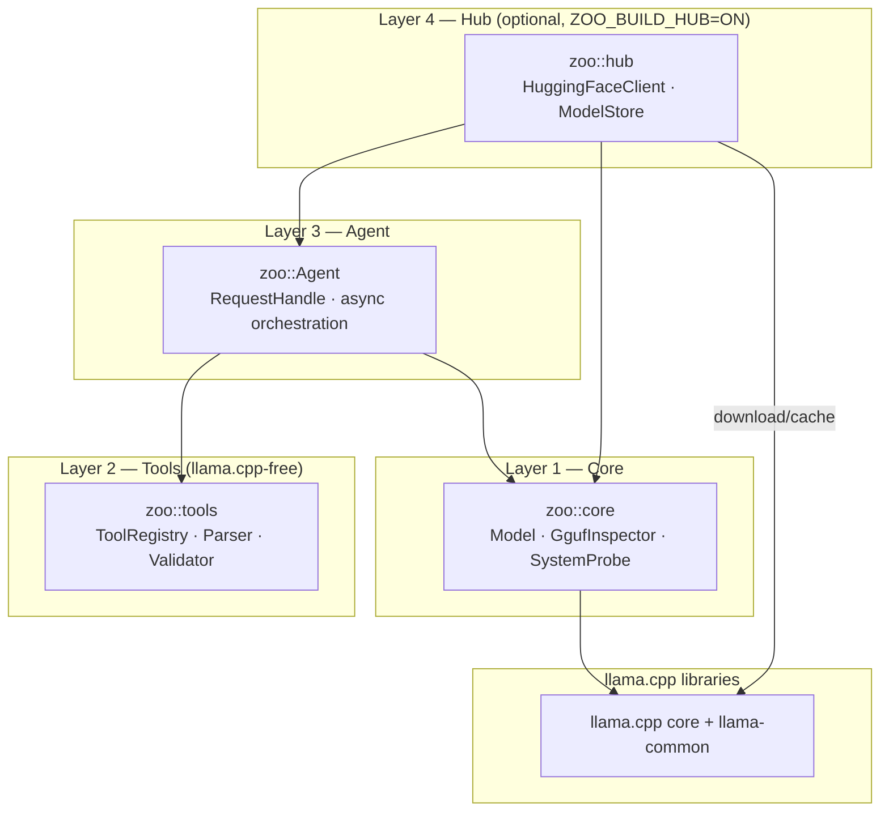

# Zoo-Keeper Architecture Snapshot

This file is a current-state reference, not release guidance. If it drifts from HEAD,
trust the public headers, examples, and changelog first.

## Objective

Zoo-Keeper is a local-first C++23 library on top of llama.cpp. It provides model
loading, inference, conversation management, native tool calling, structured
extraction, and an async agent loop for locally hosted LLMs.

The public API is intentionally small and explicit: `zoo::core::Model` for low-level
control, `zoo::Agent` for async orchestration, `zoo::hub` for model discovery and
management, and split config types for model, agent, and per-call generation policy.

## Tech Stack

- C++23
- CMake
- llama.cpp fetched at configure time via CMake `FetchContent` (pinned by `ZOO_LLAMA_TAG`)
- nlohmann/json for config and schema handling
- GoogleTest for unit and integration tests

## Supported Platforms

- Linux
- macOS

## Public API Boundary

The supported surface is:

- Installed headers under `include/zoo/`
- CMake target `ZooKeeper::zoo`
- Core types and APIs such as `ModelConfig`, `AgentConfig`, `GenerationOptions`,
  `zoo::Agent`, `zoo::core::Model`, `OwnedMessage`, `Message`,
  `MessageView`, `ConversationView`, `HistorySnapshot`, `OwnedToolCall`,
  `ToolCallInfo`, `TextResponse`, `ExtractionResponse`, `RequestHandle<T>`,
  `ToolRegistry`, `ToolCallParser`, and `ToolArgumentsValidator`

`OwnedMessage` and `OwnedToolCall` are the ownership-explicit canonical names.
`Message` and `ToolCallInfo` are stable source-compatible aliases retained for
existing consumers and examples.

`ToolCallView` and `ToolCallSpan` are retained as request-scoped borrowed APIs
for adapters that already hold structured assistant tool-call metadata. Borrowed
tool-call strings and span elements must outlive the immediate API call; retained
history uses `OwnedToolCall`.

Everything under `src/` is intentionally private, including source-local private
headers used by the agent and core runtime.

## Architecture

Four layers, each depending only on the layers below it:

| Layer | Namespace | Responsibility |
|-------|-----------|----------------|
| 4 | `zoo::hub` | **Optional.** HuggingFace downloading and local model store. Only compiled with `ZOO_BUILD_HUB=ON` |
| 3 | `zoo::Agent` | Async orchestration, request handles, history management, tool execution |
| 2 | `zoo::tools` | Tool registry, call parsing, and argument validation. Public headers are llama.cpp-free; private schema grammar helpers stay under `src/` |
| 1 | `zoo::core` | Direct llama.cpp wrapper, prompt rendering, native tool calling, structured extraction, GGUF inspection, system probing, auto-configuration |

The current core layer owns the model, context, sampler, chat templates, and the
template-driven tool/extraction grammar state, GGUF metadata inspection, host
system probing, and hardware-aware auto-configuration. The agent layer chooses
request shape and preserves or restores history as needed. The hub layer is
optional and provides HuggingFace model downloading and a local model store that
reuses core inspection/configuration APIs. Hub error codes occupy the 700-799
range.

## Error Handling

`std::expected<T, zoo::Error>` is used throughout the public surface. Exceptions are
not part of the public API contract.

## Non-Goals

- Windows support
- Multi-backend abstraction
- HTTP/REST service wrapper
- Python bindings
- Distributed inference

## Maintenance Rules

- Keep this document aligned with the current public headers and examples
- Prefer the changelog for release-specific summaries
- Treat `src/` as an implementation detail

## Verification Expectations

- `scripts/test.sh` passes
- `scripts/format.sh` produces no diff
- `scripts/lint.sh` is warning-free
- Public API changes should be reviewed deliberately
