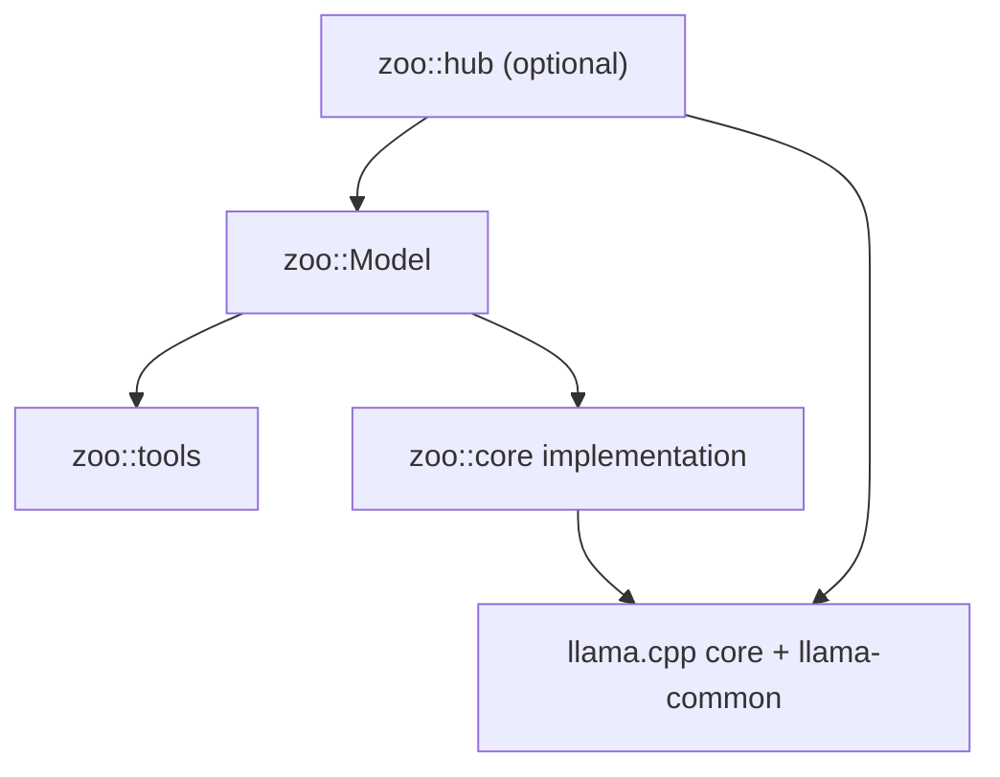

# Zoo-Keeper Architecture Snapshot

This file is a current-state reference, not release guidance. If it drifts from
HEAD, trust the public headers, examples, and changelog first.

## Objective

Zoo-Keeper is a local-first C++23 library tightly coupled to llama.cpp. It
provides GGUF model loading, synchronous inference, retained and stateless
conversation execution, native tool-call parsing, structured extraction, GGUF
inspection, hardware probing, and optional model-store/download helpers.

The primary public entry point is `zoo::Model`.

## Tech Stack

- C++23
- CMake
- llama.cpp fetched at configure time via CMake `FetchContent`
- nlohmann/json for config and schema handling
- GoogleTest for unit and integration tests

## Public API Boundary

The supported surface is:

- installed headers under `include/zoo/`
- CMake target `ZooKeeper::zoo`
- `zoo::Model`, `ModelConfig`, `GenerationOptions`, `SamplingParams`
- `OwnedMessage`, `MessageView`, `ConversationView`, `HistorySnapshot`
- `OwnedToolCall`, `ToolCallView`, `ToolSpec`
- `TextResponse`, `ExtractionResponse`, `Expected<T>`, `Error`
- `zoo::tools::ToolRegistry`, `ToolCallParser`, `ToolArgumentsValidator`
- optional `zoo::hub` APIs when `ZOO_BUILD_HUB=ON`

Everything under `src/` is private.

## Architecture

`zoo::core::Model` is the underlying implementation class behind the top-level
`zoo::Model` alias. Public headers do not include `llama.h`; llama resource
ownership is private to the model implementation.

## Error Handling

`std::expected<T, zoo::Error>` is used throughout the public surface.
Exceptions are not part of the public API contract.

## Non-Goals

- Windows support
- Multi-backend abstraction
- Autonomous agent/tool-loop runtime
- HTTP/REST service wrapper
- Python bindings
- Distributed inference
