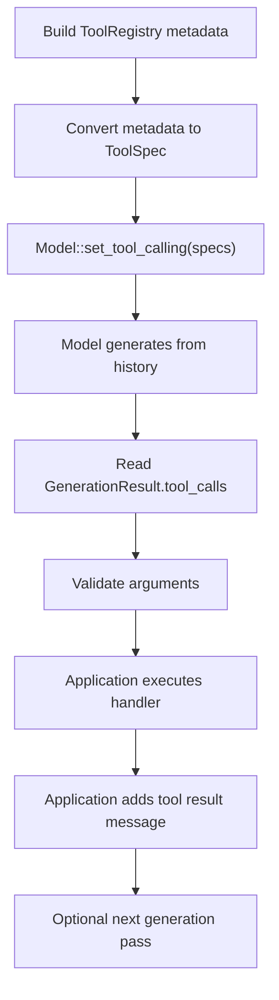

# Tool Utilities

Zoo-Keeper exposes native tool-call formatting and parsing, but it does not run
an autonomous tool loop. Applications own tool execution.

Runnable reference: [`examples/manual_tool_schema.cpp`](../examples/manual_tool_schema.cpp)

## Flow



## Typed Registration

```cpp
zoo::tools::ToolRegistry registry;

registry.register_tool("add", "Add two integers", {"a", "b"},
                       [](int a, int b) { return a + b; });
```

Supported typed parameter types:

| C++ Type | JSON Schema Type |
|----------|------------------|
| `int` | `integer` |
| `float` | `number` |
| `double` | `number` |
| `bool` | `boolean` |
| `std::string` | `string` |

## Manual Schema Registration

```cpp
nlohmann::json schema = {
    {"type", "object"},
    {"properties", {
        {"query", {{"type", "string"}, {"description", "Search term"}}},
        {"limit", {{"type", "integer"}, {"enum", {5, 10, 20}}}}
    }},
    {"required", {"query"}},
    {"additionalProperties", false}
};

registry.register_tool(
    "search_documents",
    "Search a local knowledge base.",
    schema,
    [](const nlohmann::json& args) -> zoo::Expected<nlohmann::json> {
        return nlohmann::json{{"query", args.at("query")}};
    });
```

Manual handlers accept one JSON object and return `Expected<nlohmann::json>`.

## Exposing Tools To The Model

`Model::set_tool_calling()` accepts model-facing `ToolSpec` values:

```cpp
std::vector<zoo::ToolSpec> specs;
for (const auto& metadata : registry.get_all_tool_metadata()) {
    specs.push_back(zoo::ToolSpec{
        metadata.name,
        metadata.description,
        metadata.parameters_schema,
    });
}

if (!model->set_tool_calling(specs)) {
    // The active model/template does not support native tool calling.
}
```

Zoo-Keeper asks llama.cpp's chat-template layer to choose the native format,
parser, grammar, triggers, preserved tokens, and stop sequences.

## Parsing And Validation

Use `generate_from_history()` when you need structured tool-call records:

```cpp
model->add_message(zoo::OwnedMessage::user("Search docs for llama.cpp.").view());
auto generated = model->generate_from_history();

for (const auto& call : generated->tool_calls) {
    zoo::tools::ToolCall parsed{
        call.id,
        call.name,
        nlohmann::json::parse(call.arguments_json),
    };
    auto valid = zoo::tools::ToolArgumentsValidator{}.validate(parsed, registry);
}
```

After executing a handler, add a tool result yourself if you want another model
pass:

```cpp
auto result = registry.invoke(parsed.name, parsed.arguments);
model->add_message(zoo::OwnedMessage::tool(result->dump(), parsed.id).view());
auto final = model->generate_from_history();
```

## Supported Schema Subset

Supported:

- top-level `"type": "object"`
- `"properties"` object
- primitive property types: `string`, `integer`, `number`, `boolean`
- `"required"` array
- property `"description"`
- property `"enum"`
- `"additionalProperties": false` or omission

Unsupported constructs fail during registration with
`ErrorCode::InvalidToolSchema`: nested objects, arrays, composition keywords,
`$ref`, bounds, regex patterns, and unknown semantic keywords.

## Low-Level Registry Access

`ToolRegistry` is single-threaded unless the caller externally synchronizes
overlapping reads and writes. This is deliberate: applications own handler
dispatch and can choose their own concurrency model.

## Error Codes

| Code | Name | Description |
|------|------|-------------|
| 500 | `ToolNotFound` | Requested tool name is not registered |
| 501 | `ToolExecutionFailed` | Handler returned an execution failure |
| 502 | `InvalidToolSignature` | Typed registration metadata does not match the callable |
| 505 | `InvalidToolSchema` | Manual schema uses an unsupported construct |
| 506 | `ToolValidationFailed` | Parsed arguments failed validation |
