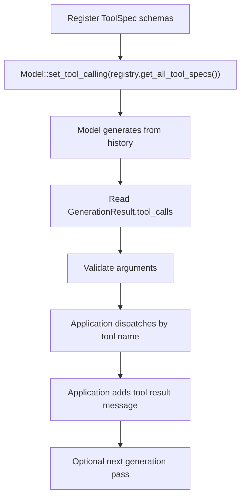

# Tool Utilities

Zoo-Keeper exposes native tool-call formatting, parsing, and validation. It does
not store executable tools or run an autonomous tool loop; applications own tool
execution.

Runnable reference: [`examples/manual_tool_schema.cpp`](../examples/manual_tool_schema.cpp)

## Flow



## Schema Registration

`ToolRegistry` stores model-facing tool specs and the normalized parameter
metadata needed for validation:

```cpp
zoo::tools::ToolRegistry registry;

nlohmann::json schema = {
    {"type", "object"},
    {"properties", {
        {"query", {{"type", "string"}, {"description", "Search term"}}},
        {"limit", {{"type", "integer"}, {"enum", {5, 10, 20}}}}
    }},
    {"required", {"query"}},
    {"additionalProperties", false}
};

auto registered = registry.register_tool(
    "search_documents",
    "Search a local knowledge base.",
    schema);
```

You can also pass an explicit `zoo::ToolSpec`:

```cpp
registry.register_tool(zoo::ToolSpec{
    "search_documents",
    "Search a local knowledge base.",
    schema,
});
```

Zoo-Keeper canonicalizes accepted schemas before storing them.

## Exposing Tools To The Model

`Model::set_tool_calling()` accepts model-facing `ToolSpec` values:

```cpp
if (!model->set_tool_calling(registry.get_all_tool_specs())) {
    // The active model/template does not support native tool calling.
}
```

Zoo-Keeper asks llama.cpp's chat-template layer to choose the native format,
parser, grammar, triggers, preserved tokens, and stop sequences.

## Parsing And Validation

Use `generate_from_history()` when you need structured tool-call records. The
generated assistant turn is committed to history, including any structured tool
calls:

```cpp
model->add_message(zoo::OwnedMessage::user("Search docs for llama.cpp.").view());
auto generated = model->generate_from_history();

for (const auto& call : generated->tool_calls) {
    zoo::tools::ToolCall parsed{
        call.id,
        call.name,
        nlohmann::json::parse(call.arguments_json),
    };
    auto valid = zoo::tools::ToolArgumentsValidator{}.validate(parsed, registry);
}
```

After validating a call, dispatch it through application code. Add a matching
tool result if you want another model pass:

```cpp
nlohmann::json result = run_application_tool(parsed.name, parsed.arguments);
model->add_message(zoo::OwnedMessage::tool(result.dump(), parsed.id).view());
auto final = model->generate_from_history();
```

## Supported Schema Subset

Supported:

- top-level `"type": "object"`
- `"properties"` object
- primitive property types: `string`, `integer`, `number`, `boolean`
- `"required"` array
- property `"description"`
- property `"enum"`
- `"additionalProperties": false` or omission

Unsupported constructs fail during registration with
`ErrorCode::InvalidToolSchema`: nested objects, arrays, composition keywords,
`$ref`, bounds, regex patterns, and unknown semantic keywords.

## Error Codes

| Code | Name | Description |
|------|------|-------------|
| 500 | `ToolNotFound` | Parsed tool name is not registered |
| 505 | `InvalidToolSchema` | Tool schema uses an unsupported construct |
| 506 | `ToolValidationFailed` | Parsed arguments failed validation |
